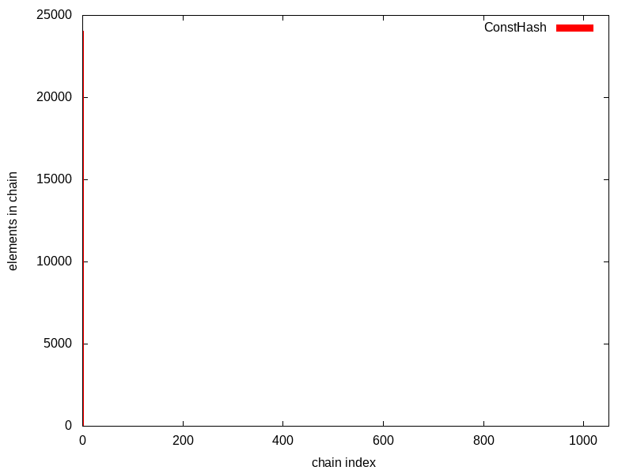
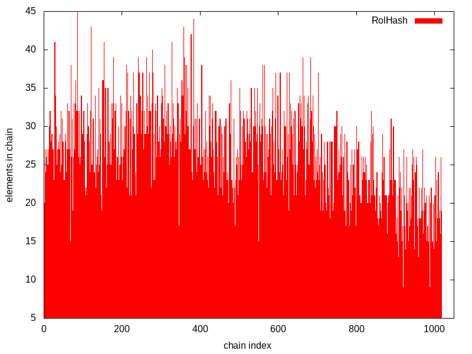
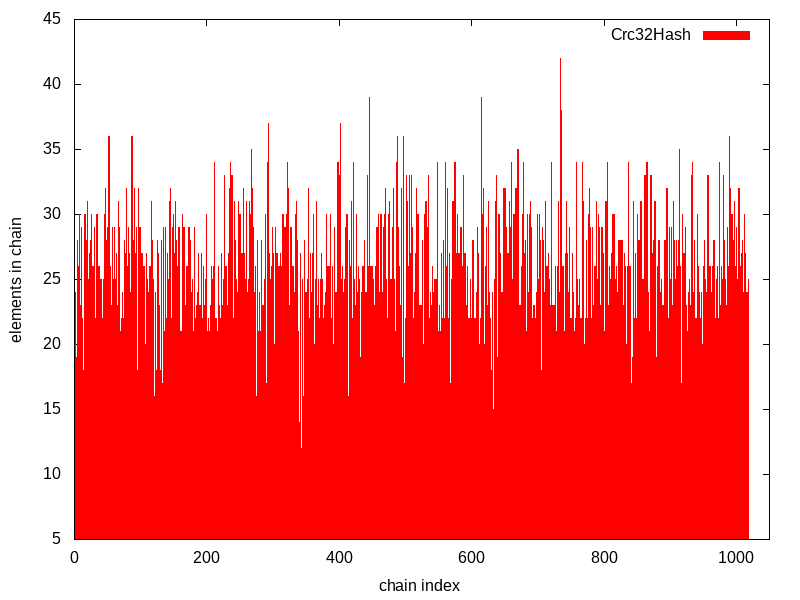
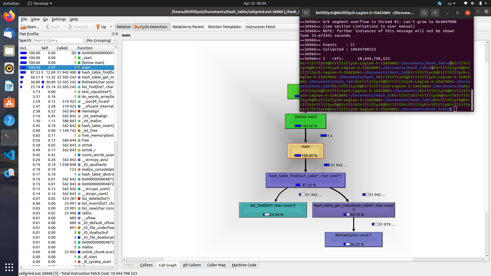

# Hash table
----
## Hash functions review
----
We have written a hash table with separate chaining. It is obvious that for hash table we need to use hash function. What should it main 
characterisic be? We count hash, get (hash % hash_table_size) value and then a long process of searching for this element in a chain begins. This operation takes a vast majority of hash table worktime. As it is worth to optimize, we need to get as uniform distribution of inserted elements
as possible in order to not overload some chains while others are empty. So the main hash function requirement is uniform distribution. Let us
investigate some examples. Hash table capacity will be deliberately decreased to overload chains. The aim is to show distribution of elements
on a diagram which is created by gnuplot utility (hash functions code can be seen in hash_funcs.cpp file, diagrams with the same scale are
in Hashes directory).

### Const hash


### First ascii code hash


### Strlen hash


### Sum of ascii codes hash


### Rol hash


### Crc32 hash


----
## Hash table optimizations
----
We have written a hash table, collision resolution is separate chaining. As it is a data structure, it would be a nice idea to implement
it as efficiently as possible.
Therefore, there is a question: can we rewrite some code in order to speed our hash table up? Let us try.

It is obvious that the main applicant to be reorganized is find function. So what we are going to do is to call it in large quantities. 
In our case the words that will be searched for will be from english-latin dictionary and the place where we will search them is 
"War and Peace" made by L. Tolstoy.
Find will be used for 100 times for each word. Callgrind (which is a plugin for valgrind) will gather data about experiment and its result 
will be processed by KCachegrind utility in graph form. Each optimization result was measured 6 times and average result is given.
Pay attention that functions that do not refer to hash table will not be optimized because
we consider them as a user data we do not have access to.

Here you can see the configuration used to compile and launch the program:
```
all:
	nasm -f elf64 vstrcmpeqb
	g++ -c -g -O0 -Wall -mavx2 hash_table.cpp list.cpp hash_funcs.cpp -no-pie
	g++ hash_table.o list.o hash_funcs.o vstrcmpeqb.o -o hash_table
	valgrind --tool=callgrind --dump-instr=yes --collect-jumps=yes ./hash_table
```

### 0) No optimization

Results of programme without any optimizations. Average time - 361.13 sec.


### 1) Optimization 1: CRC32
We can see that calculating Crc32Hash takes a significant part of time programme works, so it should be optimized.
It should be mentioned that at this time words inserted in hash table lie in one big buffer while hash table contains pointers to them,
so we are not able to work with more than one byte in a word at once at the moment. The first optimization was rewriting Crc32Hash function 
using the inline assembler:

```
asm (
        ".intel_syntax noprefix\n\t"
        "cmp byte ptr[%1], 0\n\t"
        "je .end\n\t"
        ".crc_again:\n\t"
        "   mov rcx, 7\n\t"
        ".processing_byte:\n\t"
        "   shl %0, 1\n\t"
        "   mov r15, [%1]\n\t"
        "   shr r15, cl\n\t"
        "   and r15, 1\n\t"
        "   add %0, r15\n\t"
        "   mov r15, %0\n\t"
        "   and r15, %3\n\t"
        "   cmp r15, 0\n\t"
        "   je .no_xor\n\t"
        "   xor %0, %2\n\t"
        ".no_xor:\n\t"
        "   dec rcx\n\t"
        "   cmp rcx, 0\n\t"
        "jge .processing_byte\n\t"
        "   inc %1\n\t"
        "   cmp byte ptr [%1], 0\n\t"
        "jne .crc_again\n\t"
        ".end:\n\t"
        ".att_syntax prefix\n\t"
        :"=r" (hash)
        :"rD" (key), "b" (polynom), "d" (old_bit_checker)
        : "rax", "rcx", "rdx", "rdi", "r15"
    );
```


~19 billions of instructions were shortened and programme was sped up in ~60 seconds (new average time is 303.92 sec).

### 2) Optimization 2: Hash table size
At this time we have noticed that hash table size is only 2^10 - 5 (1019 chains) and strcmp takes not much less than 1 billon instructions
which means that after calculating hash finding element in a chain takes a lot of time just because chains are overloaded. This problem can
be solved by increasing hash table size(and therefore by decreasing chains length). So we increase hash table size to 2^19 - 1 (524287 elements).


As we can see, number of instructions has decreased twice (to ~34.3 billons) and now programme's average working time is 93.7 seconds.

### 3) Optimization 3: 32byte words and better Crc32Hash
As we can see on a graph, Crc32Hash is still the biggest pain in the neck. The biggest problem is that we cannot process more than 1 byte 
in Crc32 at once because of different length of words. It can be solved by equalization of lengths of all words, each of them is now 32 bytes.
It allows us to remove all jumps, cycles and '\0' checks in Crc32Hash, so here its implementation is:

```
asm(
       ".intel_syntax noprefix\n\t"
       "crc32 %0, qword ptr [rdi]\n\t"
       "crc32 %0, qword ptr [rdi + 8]\n\t"
       "crc32 %0, qword ptr [rdi + 16]\n\t"
       "crc32 %0, qword ptr [rdi + 24]\n\t"
       ".att_syntax prefix\n\t"
       : "=ra" (hash)
       : "rD" (key)
       : "rax", "rdi"
    );
```


This is definitely a breakthrough. Now programme takes 40 sec in average vs 93.7 before this trick and number of instructions has decreased 
from 34.3 billons to ~8 billons (more than 4 times better!)

### 4) Optimization 4: strcmp
According to the previous graph, list_find function now takes even more time than calculating hash. But list_find function is highly dependent 
on strcmp and that can be seen on the image. Therefore, it should be optimized. As all words now are 32 bytes long and we only need to know whether
strings are equal or not without concretization, it is very convenient to deal with this task by using _mm256_testc_si256 intrinsic. 


Now programme takes 31.7 secs in average instead of 40 and number of instructions is reduced by 1 billon (around 7 billions now).

### 5) Optimization 5: Better RolHash
Although RolHash is not as good as Crc32Hash is, its distribution is quite good and therefore it is worth to also work with this type of hash.
Callgrind shows us that programme with non-optimized version of RolHash gives us the result of 33.1 sec in average. 



But what we can do is to try to optimize this hash function. A nice variant could be the inline assembler, but it was already used.
Let us give a chance to NASM. We will rewrite RolHash as an external function. Using intrinsics here may be not a reasonable decision because
assembler has its own ROL instruction which plays a significant role in this hash function. Moving to the code:

```
global RolHash_asm
section .text

RolHash_asm:
		xor rax, rax
		mov al, [rdi]
		inc rdi
		
.xor_again:	
		cmp byte [rdi], 0
		je .the_end
		
		rol rax, 1
		xor al, [rdi] 
		
		inc rdi
		jmp .xor_again

.the_end:		
		ret
```


After the implementation of this code programme has sped up in 2 seconds (new average time is 31.1 second) and instructions quantity 
has decreased by 2.35 billions. Very small upgrade, but let it be :\

### 6) Optimization 6: Stopping Crc32Hash at right moment
Now it seems that optimized versions of RolHash and Crc32Hash show us almost equal performance (0_o). Obviously, that is not correct, because
according to the code RolHash stops working when it sees the '\0' symbol while Crc32Hash always works for the whole bunch of 32 bytes. Hence, 
comparison was quite unfair. Let us make a small correction: each time after calling crc32 (excluding the last) we will check if the next qword 
block begins with '\0' (this means that word has already ended and there is no sense to continue calculating hash).

```
asm(
       ".intel_syntax noprefix\n\t"
       "mov rcx, 3\n\t"
       "crc32 %0, qword ptr [rdi]\n\t"
       ".decide_if_again:\n\t"
       "    add rdi, 8\n\t"
       "    cmp byte ptr [rdi], 0\n\t"
       "    je .the_end\n\t"
       "    crc32 %0, qword ptr [rdi]\n\t"
       "    loop .decide_if_again\n\t"
       ".the_end:"
       ".att_syntax prefix\n\t"
       : "=ra" (hash)
       : "rD" (key)
       : "rax", "rcx", "rdi"
    );
```


Although result has been sped up only in 2 seconds comparing to previous programme with Crc32Hash, we have not replaced any new parts of C++ 
code with assembler code, just modernized old one, portability of the whole programme was not reduced. Therefore, this optimization makes 
sense. New average time of programme working is 29.6 sec. Yes, now we have a bit more instructions (7.3 billons against 7 billions), but time 
is much more important resource.

----
## Conclusion
As a result, programme has sped up up to 12.2 times (361.13s -> 29.6s). Number of instructions has decreased even up to 12.33 times 
(90 billions -> 7.3 billions)! 

There are only 21 assembler lines in program, so KPD is 12.2 / 21 * 1000 = 581. Hooray!
